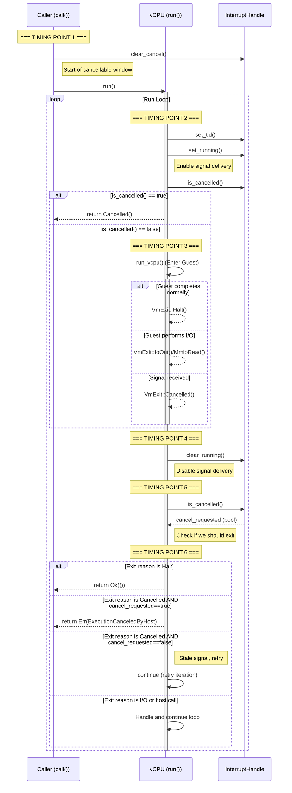
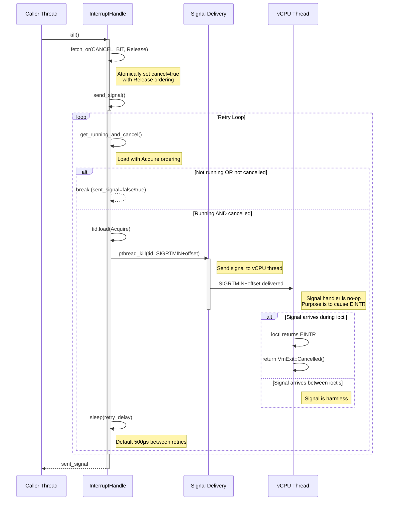
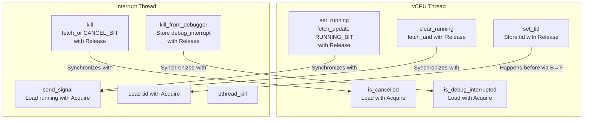

# Cancellation in Hyperlight

This document describes the cancellation mechanism and memory ordering guarantees for Hyperlight.

## Overview (Linux)

Hyperlight provides a mechanism to forcefully interrupt guest execution through the `InterruptHandle::kill()` method. This involves coordination between multiple threads using atomic operations and POSIX signals to ensure safe and reliable cancellation.

## Key Components

### LinuxInterruptHandle State

The `LinuxInterruptHandle` uses a packed atomic u64 to track execution state:

- **state (AtomicU64)**: Packs two bits:
  - **Bit 1 (RUNNING_BIT)**: Set when vCPU is actively running in guest mode
  - **Bit 0 (CANCEL_BIT)**: Set when cancellation has been requested via `kill()`
- **tid (AtomicU64)**: Thread ID where the vCPU is running
- **debug_interrupt (AtomicBool)**: Set when debugger interrupt is requested (gdb feature only)
- **dropped (AtomicBool)**: Set when the corresponding VM has been dropped

The packed state enables atomic reads of both RUNNING_BIT and CANCEL_BIT simultaneously via `get_running_and_cancel()`. Within a single `VirtualCPU::run()` call, the CANCEL_BIT remains set across vcpu exits and re-entries (such as when calling host functions), ensuring cancellation persists until the guest call completes. However, `clear_cancel()` resets the CANCEL_BIT at the beginning of each new guest function call (specifically in `MultiUseSandbox::call`, before `VirtualCPU::run()` is called), preventing cancellation requests from affecting subsequent guest function calls.

### Signal Mechanism

On Linux, Hyperlight uses `SIGRTMIN + offset` (configurable, default offset is 0) to interrupt the vCPU thread. The signal handler is intentionally a no-op - the signal's only purpose is to cause a VM exit via `EINTR` from the `ioctl` call that runs the vCPU.

## Run Loop Flow

The main execution loop in `VirtualCPU::run()` coordinates vCPU execution with potential interrupts.

### Detailed Run Loop Steps

1. **Timing Point 1** - Start of Guest Call (in `call()`):
   - `clear_cancel()` resets the cancellation state *before* `run()` is called.
   - Any `kill()` completed before this point is ignored.

2. **Timing Point 2** - Start of Loop Iteration:
   - `set_running()` enables signal delivery.
   - Checks `is_cancelled()` immediately to handle pre-run cancellation.

3. **Timing Point 3** - Guest Entry:
   - Enters guest execution.
   - If `kill()` happens now, signals will interrupt the guest.

4. **Timing Point 4** - Guest Exit:
   - `clear_running()` disables signal delivery.
   - Signals sent after this point are ignored.

5. **Timing Point 5** - Capture State:
   - `is_cancelled()` captures the cancellation request state.
   - This determines if a `Cancelled` exit was genuine or stale.

6. **Timing Point 6** - Handle Exit:
   - Processes the exit reason based on the captured `cancel_requested` state.
   - If `Cancelled` but `!cancel_requested`, it's a stale signal -> retry.

## Kill Operation Flow

The `kill()` operation involves setting the CANCEL_BIT and sending signals to interrupt the vCPU:

### Kill Operation Steps

1. **Set Cancel Flag**: Atomically set the CANCEL_BIT using `fetch_or(CANCEL_BIT)` with `Release` ordering
   - Ensures all writes before `kill()` are visible when vCPU thread checks `is_cancelled()` with `Acquire`

2. **Send Signals**: Enter retry loop via `send_signal()`
   - Atomically load both running and cancel flags via `get_running_and_cancel()` with `Acquire` ordering
   - Continue if `running=true AND cancel=true` (or `running=true AND debug_interrupt=true` with gdb)
   - Exit loop immediately if `running=false OR cancel=false`
   
3. **Signal Delivery**: Send `SIGRTMIN+offset` via `pthread_kill`
   - Signal interrupts the `ioctl` that runs the vCPU, causing `EINTR`
   - Signal handler is intentionally a no-op
   - Returns `VmExit::Cancelled()` when `EINTR` is received

4. **Loop Termination**: The signal loop terminates when:
   - vCPU is no longer running (`running=false`), OR
   - Cancellation is no longer requested (`cancel=false`)
   - See the loop termination proof in the source code for rigorous correctness analysis

## Memory Ordering Guarantees

Hyperlight uses Release-Acquire semantics to ensure correctness across threads:

### Ordering Rules

1. **tid Store → running Load**: `set_tid` (Release) synchronizes with `send_signal` (Acquire), ensuring the interrupt thread sees the correct thread ID.
2. **CANCEL_BIT**: `kill` (Release) synchronizes with `is_cancelled` (Acquire), ensuring the vCPU sees the cancellation request.
3. **clear_running**: `clear_running` (Release) synchronizes with `send_signal` (Acquire), ensuring the interrupt thread stops sending signals when the vCPU stops.
4. **clear_cancel**: Uses Release to ensure operations from the previous run are visible to other threads.
5. **dropped flag**: `set_dropped` (Release) synchronizes with `dropped` (Acquire), ensuring cleanup visibility.
6. **debug_interrupt**: `kill_from_debugger` (Release) synchronizes with `is_debug_interrupted` (Acquire), ensuring the vCPU sees the debug interrupt request.

## Interaction with Host Function Calls

When a guest performs a host function call, the vCPU exits and `RUNNING_BIT` is cleared. `CANCEL_BIT` persists, so if `kill()` is called during the host call, cancellation is detected when the guest attempts to resume.

## Signal Behavior Across Loop Iterations

When the run loop iterates (e.g., for host calls):
1. `clear_running()` sets `running=false`, causing any active `send_signal()` loop to exit.
2. `set_running()` sets `running=true` again.
3. `is_cancelled()` detects the persistent `cancel` flag and returns early.

## Race Conditions

1. **kill() between calls**: `clear_cancel()` at Timing Point 1 ensures `kill()` requests from before the current call are ignored.
2. **kill() before run_vcpu()**: Signals interrupt the guest immediately.
3. **Guest completes before signal**: If the guest finishes naturally, the signal is ignored or causes a retry in the next iteration (handled as stale).
4. **Stale signals**: If a signal from a previous call arrives during a new call, `cancel_requested` (checked at Timing Point 5) will be false, causing a retry.
5. **ABA Problem**: Clearing `CANCEL_BIT` at the start of `run()` breaks any ongoing `send_signal()` loops from previous calls.

## Windows Platform Differences

While the core cancellation mechanism follows the same conceptual model on Windows, there are several platform-specific differences in implementation:

### WindowsInterruptHandle Structure

The `WindowsInterruptHandle` uses a simpler structure compared to Linux:

- **state (AtomicU64)**: Packs the same two bits (RUNNING_BIT and CANCEL_BIT)
- **debug_interrupt (AtomicBool)**: Set when debugger interrupt is requested (gdb feature only)
- **partition_handle**: Windows Hyper-V partition handle for the VM
- **dropped (AtomicBool)**: Set when the corresponding VM has been dropped

**Key difference**: No `tid` field is needed because Windows doesn't use thread-targeted signals. No `retry_delay` or `sig_rt_min_offset` fields are needed.

### Kill Operation Differences

On Windows, the `kill()` method uses the Windows Hypervisor Platform (WHP) API `WHvCancelRunVirtualProcessor` instead of POSIX signals to interrupt the vCPU:

**Key differences**:
1. **No signal loop**: Windows calls `WHvCancelRunVirtualProcessor()` at most once in `kill()`, without needing retries

### Why Linux Needs a Retry Loop but Windows Doesn't

The fundamental difference between the platforms lies in how cancellation interacts with the hypervisor:

**Linux (KVM/mshv3)**: POSIX signals can only interrupt the vCPU when the thread is executing kernel code (specifically, during the `ioctl` syscall that runs the vCPU). There is a narrow timing window between when the signal is sent and when the vCPU enters guest mode. If a signal arrives before entering guest mode, it will be delivered but won't interrupt the guest execution. This requires repeatedly sending signals with delays until either:
- The vCPU exits (and consequently RUNNING_BIT becomes false), or
- The cancellation is cleared (CANCEL_BIT becomes false)

**Windows (WHP)**: The `WHvCancelRunVirtualProcessor()` API sets an internal `CancelPending` flag in the Windows Hypervisor Platform. This flag is:
- Set immediately by the API call
- Checked at the start of each VM run loop iteration (before entering guest mode)
- Automatically cleared when it causes a `WHvRunVpExitReasonCanceled` exit

This means if `WHvCancelRunVirtualProcessor()` is called:
- **While the vCPU is running**: The API signals the hypervisor to exit with `WHvRunVpExitReasonCanceled`
- **Before VM runs**: The `CancelPending` flag persists and causes an immediate cancellation on the next VM run attempt

Therefore, we only call `WHvCancelRunVirtualProcessor()` after checking that `RUNNING_BIT` is set. This is important because:
1. If called when not running, the API would still succeed and will unconditionally cancel the next run attempt. This is bad since `kill()` should have no effect if the vCPU is not running
2. This makes the InterruptHandle's `CANCEL_BIT` (which is cleared at the start of each guest function call) the source of truth for whether cancellation is intended for the current call

