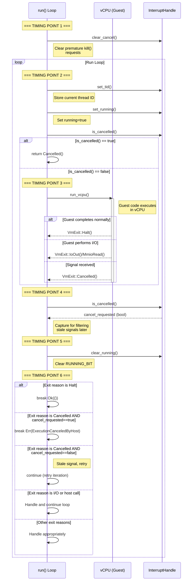
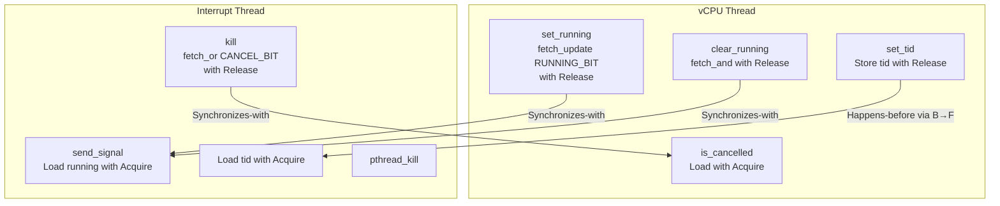
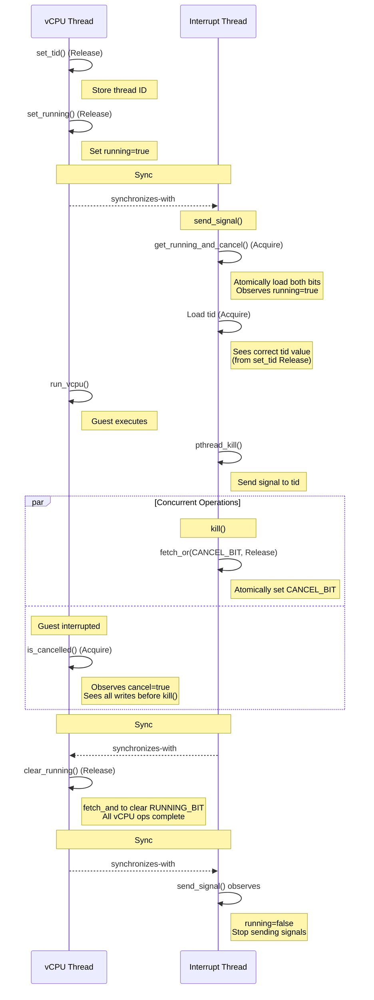

# Cancellation and Memory Ordering in Hyperlight (Linux)

This document describes the cancellation mechanism and memory ordering guarantees for Hyperlight on Linux platforms (KVM and mshv3).

## Overview

Hyperlight provides a mechanism to forcefully interrupt guest execution through the `InterruptHandle::kill()` method. This involves coordination between multiple threads using atomic operations and POSIX signals to ensure safe and reliable cancellation.

## Key Components

### LinuxInterruptHandle State

The `LinuxInterruptHandle` uses a packed atomic u64 to track execution state:

- **state (AtomicU64)**: Packs two bits:
  - **Bit 1 (RUNNING_BIT)**: Set when vCPU is actively running in guest mode
  - **Bit 0 (CANCEL_BIT)**: Set when cancellation has been requested via `kill()`
- **tid (AtomicU64)**: Thread ID where the vCPU is running
- **debug_interrupt (AtomicBool)**: Set when debugger interrupt is requested (gdb feature only)
- **dropped (AtomicBool)**: Set when the corresponding VM has been dropped

The packed state allows atomic snapshots of both RUNNING_BIT and CANCEL_BIT via `get_running_and_cancel()`. The CANCEL_BIT persists across vcpu exits/re-entries within a single `run()` call (e.g., during host function calls), but is cleared at the start of each new `run()` call.

### Signal Mechanism

On Linux, Hyperlight uses `SIGRTMIN + offset` (configurable, default offset is typically 0) to interrupt the vCPU thread. The signal handler is intentionally a no-op - the signal's only purpose is to cause a VM exit via `EINTR` from the `ioctl` call that runs the vCPU.

## Run Loop Flow

The main execution loop in `HyperlightVm::run()` coordinates vCPU execution with potential interrupts. Here's the detailed flow:



### Detailed Run Loop Steps

1. **Timing Point 1** - Between guest function calls:
   - `clear_cancel()` is called to clear any stale CANCEL_BIT
   - If `kill()` completes before this point, it has NO effect on this call
   - Ensures that `kill()` between different guest function calls doesn't affect the next call

2. **Timing Point 2** - Before entering run loop iteration:
   - `set_tid()` stores the current thread ID
   - `set_running()` sets running to true
   - If `kill()` completes before this, early `Cancelled()` is returned

3. **Timing Point 3** - Before calling `run_vcpu()`:
   - If `kill()` completes before this, CANCEL_BIT is set but too late to prevent entering guest
   - Signals will interrupt the guest (RUNNING_BIT=true), causing `VmExit::Cancelled()`
   - If guest completes before signals arrive, `kill()` may have no effect on this iteration

4. **Timing Point 4** - After vCPU exits, before capturing `cancel_requested`:
   - CANCEL_BIT is captured for filtering stale signals
   - If `kill()` completes before this, CANCEL_BIT persists for next iteration

5. **Timing Point 5** - Before calling `clear_running()`:
   - Same as point 4

6. **Timing Point 6** - After calling `clear_running()`:
   - RUNNING_BIT is now false, no new signals will be sent
   - CANCEL_BIT may be set but won't affect this iteration
   - Stale signals may arrive but are filtered by the `cancel_requested` check

## Kill Operation Flow

The `kill()` operation involves setting the CANCEL_BIT and sending signals to interrupt the vCPU:


### Kill Operation Steps

1. **Set Cancel Flag**: Atomically set the CANCEL_BIT using `fetch_or(CANCEL_BIT)` with `Release` ordering
   - Ensures all writes before `kill()` are visible when vCPU thread checks `is_cancelled()` with `Acquire`

2. **Send Signals**: Enter retry loop via `send_signal()`
   - Atomically load both running and cancel flags via `get_running_and_cancel()` with `Acquire` ordering
   - Continue if `running=true AND cancel=true` (or `running=true AND debug_interrupt=true` with gdb)
   - Exit loop immediately if `running=false OR cancel=false`
   
3. **Signal Delivery**: Send `SIGRTMIN+offset` via `pthread_kill`
   - Signal interrupts the `ioctl` that runs the vCPU, causing `EINTR`
   - Signal handler is intentionally a no-op
   - Returns `VmExit::Cancelled()` when `EINTR` is received

4. **Loop Termination**: The signal loop terminates when:
   - vCPU is no longer running (`running=false`), OR
   - Cancellation is no longer requested (`cancel=false`)
   - See the loop termination proof in the source code for rigorous correctness analysis

## Memory Ordering Guarantees

### Release-Acquire Semantics Overview

A **synchronizes-with** relationship is established when:
1. Thread A performs an atomic operation with `Release` ordering that writes a value
2. Thread B performs an atomic operation with `Acquire` ordering on the same atomic variable
3. Thread B's `Acquire` load reads the exact value that Thread A's `Release` operation wrote

When this occurs, all memory operations that happened-before the `Release` in Thread A become visible to Thread B after the `Acquire`. This creates a **happens-before** relationship that ensures memory consistency across threads.

### Synchronization in Hyperlight

Hyperlight uses careful memory ordering to ensure correctness across threads:



### Ordering Rules

1. **tid Store → running Load Synchronization**:
   - `set_tid()`: Stores `tid` with `Release` ordering
   - `set_running()`: Sets RUNNING_BIT with `Release` ordering (via `fetch_or`)
   - `send_signal()`: Loads `state` with `Acquire` ordering via `get_running_and_cancel()`
   - **Guarantee**: When interrupt thread observes RUNNING_BIT=true, it sees the correct `tid` value

2. **CANCEL_BIT Synchronization**:
   - `kill()`: Sets CANCEL_BIT with `Release` ordering (via `fetch_or`)
   - `is_cancelled()`: Loads `state` with `Acquire` ordering
   - **Guarantee**: When vCPU thread observes CANCEL_BIT=true, it sees all writes before `kill()`

3. **clear_running Synchronization**:
   - `clear_running()`: Clears RUNNING_BIT with `Release` ordering (via `fetch_and`)
   - `send_signal()`: Loads `state` with `Acquire` ordering via `get_running_and_cancel()`
   - **Guarantee**: When interrupt thread observes RUNNING_BIT=false, all vCPU operations are complete

4. **clear_cancel Synchronization**:
   - `clear_cancel()`: Clears CANCEL_BIT with `Release` ordering (via `fetch_and`)
   - **Rationale**: Uses Release because the VM can move between threads across guest calls, ensuring operations from previous run() are visible to other threads

5. **dropped flag**:
   - `set_dropped()`: Uses `Release` ordering
   - `dropped()`: Uses `Acquire` ordering
   - **Guarantee**: All VM cleanup operations are visible when `dropped()` returns true

### Happens-Before Relationships



## Interaction with Host Function Calls

When a guest performs a host function call, the vCPU exits and the host function executes with `RUNNING_BIT=false`, preventing signal delivery during host execution. The `CANCEL_BIT` persists across this exit and re-entry, so if `kill()` was called, cancellation will be detected when the guest attempts to resume execution. This ensures cancellation takes effect even if it occurs during a host call, while avoiding signals during non-guest code execution.

## Signal Behavior Across Loop Iterations

When the run loop iterates (e.g., for host calls or IO operations):

1. Before host call: `clear_running()` sets `running=false`
2. `send_signal()` loop checks `running && cancel` - exits immediately when `running=false`
3. After host call: `set_running()` sets `running=true` again
4. `is_cancelled()` check detects persistent `cancel` flag and returns early

**Key insight**: The `running && cancel` check is sufficient. When `running` becomes false (host call starts), the signal loop exits immediately. When the vCPU would resume, the early `is_cancelled()` check catches the persistent `cancel` flag before entering the guest.

**Signal Chaining Note**: Hyperlight does not provide signal chaining for `SIGRTMIN+offset`. Since Hyperlight may issue signals back-to-back during cancellation retry loop, it's unlikely embedders want to handle these signals.

## Race Conditions and Edge Cases

### Race 1: kill() called between guest function calls

```
Timeline:
t1: Guest function #1 completes, run() returns
t2: kill() is called (sets CANCEL_BIT)
t3: Guest function #2 starts, run() is called
t4: clear_cancel() clears CANCEL_BIT

Result: Guest function #2 executes normally (not cancelled)
```

**This is by design** - cancellation is scoped to a single guest function call.

### Race 2: kill() called just before run_vcpu()

```
Timeline:
t1: set_running() sets RUNNING_BIT
t2: kill() sets CANCEL_BIT and sends signals
t3: run_vcpu() enters guest

Result: Signals interrupt the guest, causing VmExit::Cancelled()
```

**Handled correctly** - signals cause VM exit.

### Race 3: Guest completes before signal arrives

```
Timeline:
t1: kill() sets CANCEL_BIT and sends signal
t2: Guest completes naturally
t3: clear_running() clears RUNNING_BIT
t4: Signal arrives (too late)

Result: If guest completes normally (Halt), returns Ok()
        If guest exits for I/O, next iteration will be cancelled
```

**Acceptable behavior** - cancellation is best-effort.

### Race 4: Stale signals

```
Timeline:
t1: kill() sends signals while RUNNING_BIT=true
t2: clear_running() clears RUNNING_BIT
t3: Stale signal arrives

Result: is_cancelled() returns true, causing VmExit::Cancelled()
        But cancel_requested was captured at timing point 4
        Stale signal is filtered out and iteration continues
```

**Handled correctly** - `cancel_requested` flag filters stale signals.

### Race 5: ABA Problem

The ABA problem (where a new guest call starts during the InterruptHandle's `send_signal()` loop, potentially causing the loop to send signals to a different guest call) is prevented by clearing CANCEL_BIT at the start of each `run()` call, ensuring each guest call starts with a clean cancellation state. This breaks out any ongoing slow `send_signal()` loops from previous calls that did not have time to observe the cleared CANCEL_BIT after the first `run()` call completed.
