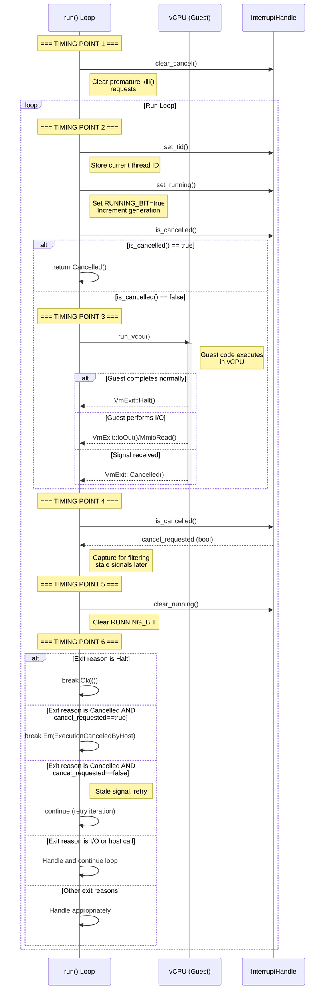
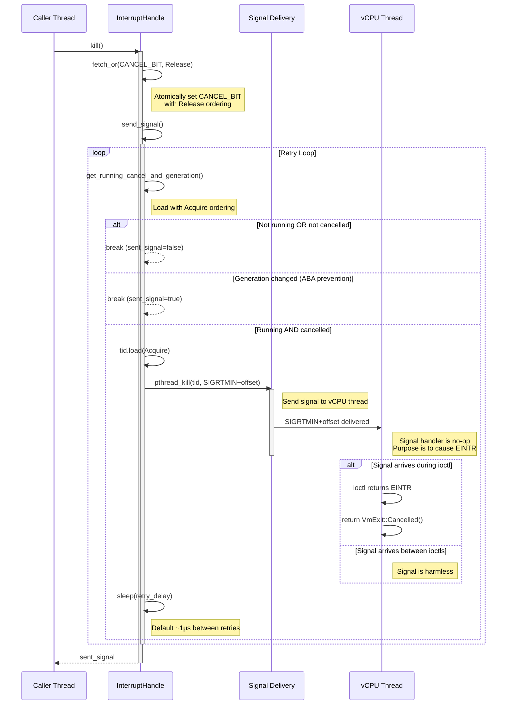
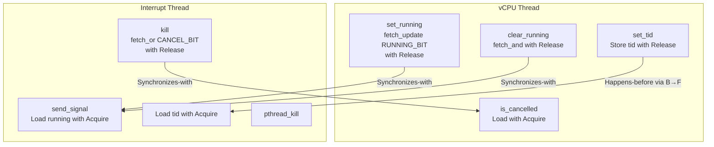
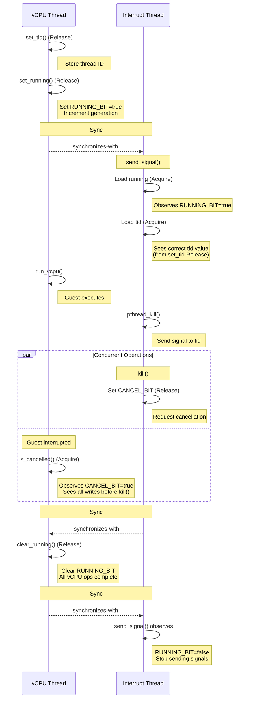
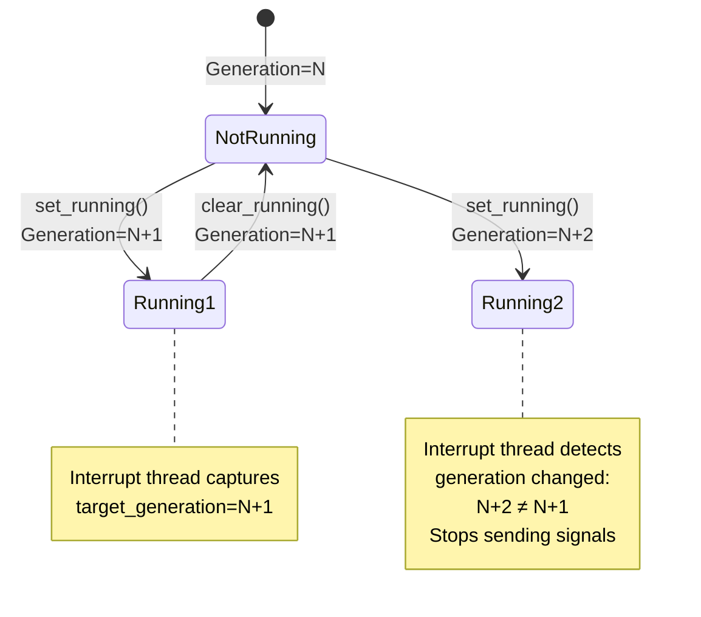

# Cancellation and Memory Ordering in Hyperlight (Linux)

This document describes the cancellation mechanism and memory ordering guarantees for Hyperlight on Linux platforms (KVM and mshv3).

## Overview

Hyperlight provides a mechanism to forcefully interrupt guest execution through the `InterruptHandle::kill()` method. This involves coordination between multiple threads using atomic operations and POSIX signals to ensure safe and reliable cancellation.

## Key Components

### LinuxInterruptHandle State

The `LinuxInterruptHandle` uses an atomic `u64` value to pack multiple pieces of state:

```
Bit Layout of running: AtomicU64
┌─────────────┬──────────────┬───────────────────────────┐
│  Bit 63     │   Bit 62     │      Bits 61-0            │
│ RUNNING_BIT │ CANCEL_BIT   │   Generation Counter      │
└─────────────┴──────────────┴───────────────────────────┘
```

- **RUNNING_BIT (bit 63)**: Set when vCPU is actively running in guest mode
- **CANCEL_BIT (bit 62)**: Set when cancellation has been requested via `kill()`
- **Generation Counter (bits 0-61)**: Incremented on each vCPU run to prevent ABA problems
- **tid (AtomicU64)**: Thread ID where the vCPU is running
- **debug_interrupt (AtomicBool)**: Set when debugger interrupt is requested (gdb feature only)
- **dropped (AtomicBool)**: Set when the corresponding VM has been dropped

### Signal Mechanism

On Linux, Hyperlight uses `SIGRTMIN + offset` (configurable, default offset is typically 0) to interrupt the vCPU thread. The signal handler is intentionally a no-op - the signal's only purpose is to cause a VM exit via `EINTR` from the `ioctl` call that runs the vCPU.

## Run Loop Flow

The main execution loop in `HyperlightVm::run()` coordinates vCPU execution with potential interrupts. Here's the detailed flow:



### Detailed Run Loop Steps

1. **Timing Point 1** - Between guest function calls:
   - `clear_cancel()` is called to clear any stale CANCEL_BIT
   - If `kill()` completes before this point, it has NO effect on this call
   - Ensures that `kill()` between different guest function calls doesn't affect the next call

2. **Timing Point 2** - Before entering run loop iteration:
   - `set_tid()` stores the current thread ID
   - `set_running()` sets RUNNING_BIT and increments generation counter
   - If `kill()` completes before this, early `Cancelled()` is returned

3. **Timing Point 3** - Before calling `run_vcpu()`:
   - If `kill()` completes before this, CANCEL_BIT is set but too late to prevent entering guest
   - Signals will interrupt the guest (RUNNING_BIT=true), causing `VmExit::Cancelled()`
   - If guest completes before signals arrive, `kill()` may have no effect on this iteration

4. **Timing Point 4** - After vCPU exits, before capturing `cancel_requested`:
   - CANCEL_BIT is captured for filtering stale signals
   - If `kill()` completes before this, CANCEL_BIT persists for next iteration

5. **Timing Point 5** - Before calling `clear_running()`:
   - Same as point 4

6. **Timing Point 6** - After calling `clear_running()`:
   - RUNNING_BIT is now false, no new signals will be sent
   - CANCEL_BIT may be set but won't affect this iteration
   - Stale signals may arrive but are filtered by the `cancel_requested` check

## Kill Operation Flow

The `kill()` operation involves setting the CANCEL_BIT and sending signals to interrupt the vCPU:



### Kill Operation Steps

1. **Set CANCEL_BIT**: Atomically set the CANCEL_BIT using `fetch_or` with `Release` ordering
   - Ensures all writes before `kill()` are visible when vCPU thread checks `is_cancelled()` with `Acquire`

2. **Send Signals**: Enter retry loop to send signals
   - Check if vCPU is running and cancellation/debug interrupt is requested
   - Use `Acquire` ordering to read `running` to synchronize with `Release` in `set_running()`
   - This ensures we see the correct `tid` value
   
3. **Signal Delivery**: Send `SIGRTMIN+offset` via `pthread_kill`
   - Signal interrupts the `ioctl` that runs the vCPU, causing `EINTR`
   - Signal handler is intentionally a no-op
   - Returns `VmExit::Cancelled()` when `EINTR` is received

4. **Retry Loop**: Continue sending signals until:
   - vCPU is no longer running (RUNNING_BIT cleared)
   - Generation counter changes (prevents ABA problem)
   - Cancellation/debug interrupt is cleared

## Memory Ordering Guarantees

### Release-Acquire Semantics Overview

A **synchronizes-with** relationship is established when:
1. Thread A performs an atomic operation with `Release` ordering that writes a value
2. Thread B performs an atomic operation with `Acquire` ordering on the same atomic variable
3. Thread B's `Acquire` load reads the exact value that Thread A's `Release` operation wrote

When this occurs, all memory operations that happened-before the `Release` in Thread A become visible to Thread B after the `Acquire`. This creates a **happens-before** relationship that ensures memory consistency across threads.

### Synchronization in Hyperlight

Hyperlight uses careful memory ordering to ensure correctness across threads:



### Ordering Rules

1. **tid Store → running Load Synchronization**:
   - `set_tid()`: Stores `tid` with `Release` ordering
   - `set_running()`: Uses `Release` ordering
   - `send_signal()`: Loads `running` with `Acquire` ordering
   - **Guarantee**: When interrupt thread observes RUNNING_BIT=true, it sees the correct `tid` value

2. **CANCEL_BIT Synchronization**:
   - `kill()`: Sets CANCEL_BIT with `Release` ordering
   - `is_cancelled()`: Loads with `Acquire` ordering
   - **Guarantee**: When vCPU thread observes CANCEL_BIT=true, it sees all writes before `kill()`

3. **clear_running Synchronization**:
   - `clear_running()`: Clears RUNNING_BIT with `Release` ordering
   - `send_signal()`: Loads with `Acquire` ordering
   - **Guarantee**: When interrupt thread observes RUNNING_BIT=false, all vCPU operations are complete

4. **clear_cancel**:
   - Uses `Relaxed` ordering
   - **Rationale**: Only vCPU thread clears this bit at the start of `run()`, no race condition

### Happens-Before Relationships



## Interaction with Host Function Calls

When a guest performs a host function call, the vCPU exits and the host function executes with `RUNNING_BIT=false`, preventing signal delivery during host execution. The `CANCEL_BIT` persists across this exit and re-entry, so if `kill()` was called, cancellation will be detected when the guest attempts to resume execution. This ensures cancellation takes effect even if it occurs during a host call, while avoiding signals during non-guest code execution.

## ABA Problem Prevention

The generation counter prevents the ABA problem where:

1. vCPU runs with generation N (e.g., in guest code)
2. Interrupt thread reads generation N and RUNNING_BIT=true, begins sending signals
3. vCPU exits (e.g., for a host call), RUNNING_BIT=false
4. vCPU runs again with generation N+1 (re-entering guest), RUNNING_BIT=true
5. Without generation counter, interrupt thread would continue sending signals to the new iteration

**Solution**: The interrupt thread captures the generation when it first observes RUNNING_BIT=true, and stops sending signals if the generation changes. This ensures signals are only sent during the intended vCPU run iteration within a single `run()` call.



## Signal Safety

The signal handler is designed to be async-signal-safe:

```c
extern "C" fn vm_kill_signal(_: libc::c_int, _: *mut libc::siginfo_t, _: *mut libc::c_void) {
    // Do nothing. SIGRTMIN is just used to issue a VM exit to the underlying VM.
}
```

**Why no-op?**
- Signal's purpose is to interrupt the `ioctl` system call via `EINTR`
- No unsafe operations (allocation, locks, etc.) in signal handler
- Actual cancellation handling occurs in the main vCPU thread after `ioctl` returns

**Signal Chaining Note**: Hyperlight does not provide signal chaining for `SIGRTMIN+offset`. Since Hyperlight may issue ~200 signals back-to-back during cancellation retry loop, it's unlikely embedders want to handle these signals.

## Race Conditions and Edge Cases

### Race 1: kill() called between guest function calls

```
Timeline:
t1: Guest function #1 completes, run() returns
t2: kill() is called (sets CANCEL_BIT)
t3: Guest function #2 starts, run() is called
t4: clear_cancel() clears CANCEL_BIT

Result: Guest function #2 executes normally (not cancelled)
```

**This is by design** - cancellation is scoped to a single guest function call.

### Race 2: kill() called just before run_vcpu()

```
Timeline:
t1: set_running() sets RUNNING_BIT
t2: kill() sets CANCEL_BIT and sends signals
t3: run_vcpu() enters guest

Result: Signals interrupt the guest, causing VmExit::Cancelled()
```

**Handled correctly** - signals cause VM exit.

### Race 3: Guest completes before signal arrives

```
Timeline:
t1: kill() sets CANCEL_BIT and sends signal
t2: Guest completes naturally
t3: clear_running() clears RUNNING_BIT
t4: Signal arrives (too late)

Result: If guest completes normally (Halt), returns Ok()
        If guest exits for I/O, next iteration will be cancelled
```

**Acceptable behavior** - cancellation is best-effort.

### Race 4: Stale signals

```
Timeline:
t1: kill() sends signals while RUNNING_BIT=true
t2: clear_running() clears RUNNING_BIT
t3: Stale signal arrives

Result: is_cancelled() returns true, causing VmExit::Cancelled()
        But cancel_requested was captured at timing point 4
        Stale signal is filtered out and iteration continues
```

**Handled correctly** - `cancel_requested` flag filters stale signals.

## Performance Considerations

- **Signal Retry**: Default retry delay is ~1μs between signals
- **Signal Volume**: May send up to ~200 signals during cancellation
- **Memory Ordering**: Acquire/Release ordering has minimal overhead on modern x86_64 CPUs
- **Atomic Operations**: All atomic operations are lock-free on 64-bit platforms

## Summary

Hyperlight's cancellation mechanism on Linux provides:

1. **Thread-safe cancellation** via atomic operations and memory ordering
2. **Signal-based interruption** using `SIGRTMIN+offset` to cause VM exits
3. **ABA problem prevention** through generation counters
4. **Scoped cancellation** that applies to single guest function calls
5. **Race condition handling** for various timing scenarios
6. **Async-signal-safe implementation** with no-op signal handler

The design balances correctness, performance, and usability for forceful guest interruption.
